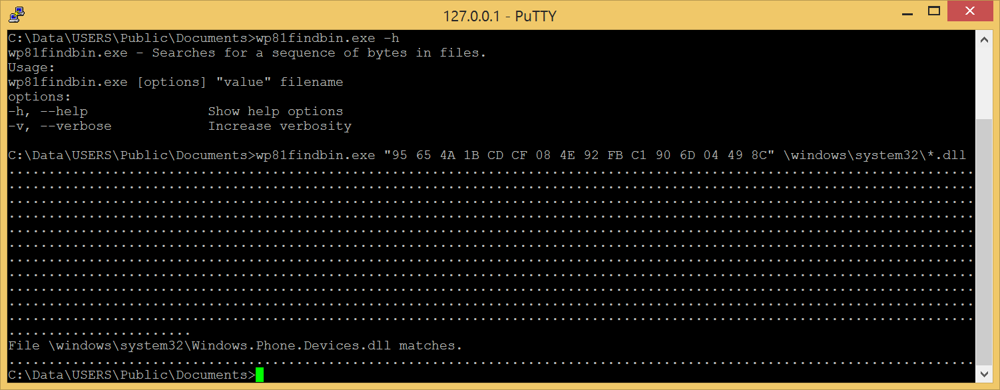

# Wp81FindBin

Like the [findstr](https://learn.microsoft.com/en-us/windows-server/administration/windows-commands/findstr) command of Windows Phone 8.1 but to find files containing a sequence of bytes.

## Usage

The sequence of bytes must be enclosed between double quotes, each byte must be in hexadecimal, separator is the space character.
  
## Deployment

- [Install a telnet server on the phone](https://github.com/fredericGette/wp81documentation/tree/main/telnetOverUsb#readme), in order to run the application.  
- Manually copy the executable from the root of this GitHub repository to the shared folder of the phone.
> [!NOTE]
> When you connect your phone with a USB cable, this folder is visible in the Explorer of your computer. And in the phone, this folder is mounted in `C:\Data\USERS\Public\Documents`  
